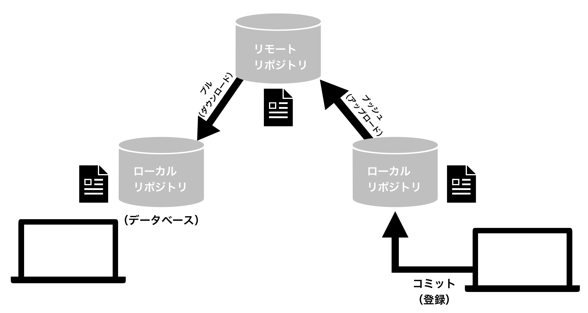

## バージョン管理システム
→複数の人とチームでサイトを作るときや、他の人とコードを共有するときに、誤って編集の衝突などが起こらないようにするために必要！

- [Git](https://git-scm.com/)
- [GitHub](https://github.co.jp/)や [GitLab](https://about.gitlab.com/ja-jp/free-trial/devsecops/?utm_medium=cpc&utm_source=google&utm_campaign=gitlab_search_jp&utm_content=jp_gitlab_core&utm_term=gitlab&_bt=688648595977&_bk=gitlab&_bm=e&_bn=g&_bg=158217178219&gad_source=1&gclid=CjwKCAiAopuvBhBCEiwAm8jaMfGSXq-X15UQCGR5oipl-H2pJgOPGCpEbIdL_Q-nAMdL3QZizuHJyBoCkkYQAvD_BwE)(コードホスティングサービス)

**[Git](https://git-scm.com/)**
- ソースコードや変更履歴を管理するために使われる、代表的な分散型バージョン管理システム
- 古いバージョンから新しいバージョンのファイルまで管理できる
- 簡単に古いバージョンに戻せる
- チームでファイルや変更履歴をスムーズに共有できる
- キーボードで入力するコマンドによって操作するツール

### Gitを使う際に知っておきたい仕組み

**[GitHub](https://github.co.jp/)**
- オンラインでソースコードやその変更履歴を共有・管理できるウェブサービス。また世界中の開発者がGitHubを使ってソースコードを公開しており、ユーザーはそれらソースコードを検索して活用することができる

### GitとGithubの違い
- Git：誰がいつどのように編集したかを正確に把握できるバージョン管理システム
- Github:Gitの仕組みと連携して、他のユーザーとやりとりしやすくしているWEBサービスの名称

**[GitLab](https://about.gitlab.com/ja-jp/free-trial/devsecops/?utm_medium=cpc&utm_source=google&utm_campaign=gitlab_search_jp&utm_content=jp_gitlab_core&utm_term=gitlab&_bt=688648595977&_bk=gitlab&_bm=e&_bn=g&_bg=158217178219&gad_source=1&gclid=CjwKCAiAopuvBhBCEiwAm8jaMfGSXq-X15UQCGR5oipl-H2pJgOPGCpEbIdL_Q-nAMdL3QZizuHJyBoCkkYQAvD_BwE)**
- 変更内容をリモートリポジトリにマージするタイミング以外は、ネットに接続しないで(オフラインで)作業することが可能
- DevOps(開発者と運用者)のライフサイクル全体をカバーするオールインワンのアプリケーションで、GitLabだけで、DevOpsを実践するために必要なツールを揃えることができる
- Docker等その他ツールと連携可能

### GitHubとGitLabの違い
- GitHub:可用性が高く、*インフラストラクチャのパフォーマンスに重点を置いている
- GitLab:ウェブ開発者のための一元化された統合プラットフォームで機能ベースのシステムを提供することに重点を置いている

*ハードウェア、ソフトウェア、ネットワーク、データベースなどを使用した ITサービスやITソリューションを提供するためのIT環境の運用と管理をしている部分
