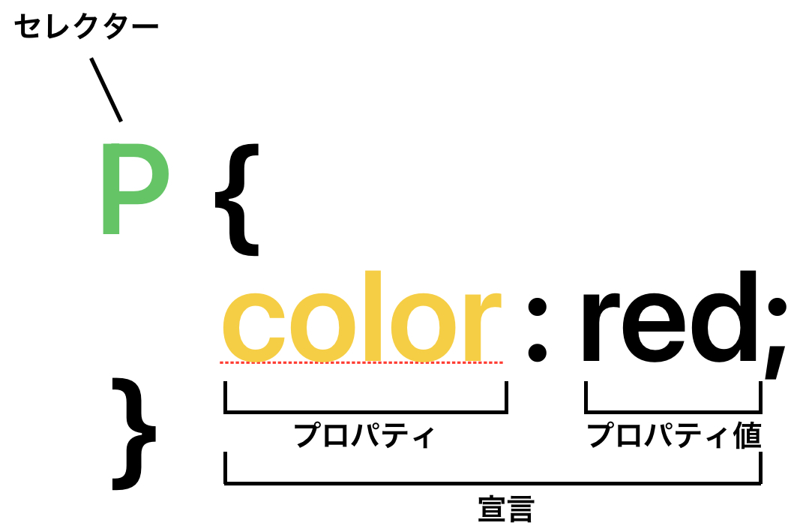

## CSS (Cascading Style Sheets)
- HTML のように、CSS は本当のプログラミング言語ではなくまたマークアップ言語でもない。CSS はスタイルシート言語
- CSS は、HTML の要素を選択的にスタイルにするために使うもの

### CSS ルールセットの構造（全体の構造はルールセットと呼ぶ）


### 複数の要素の選択
- 複数の要素を選択して、そのすべてに一つのルールセットを適用することも可能。複数のセレクターはカンマで区切る
```rb
p,
li,
h1 {
  color: red;
}
```
<details><summary>idセレクターとclassセレクターの違い</summary></summary>

- 「idセレクター」はHTML文書内で重複して「id属性」の値に設定することはできない。ページ内に一つだけある要素のスタイルを設定するために使う

### CSSにおけるclassセレクタの書き方
```rb
.class名{
プロパティ: 値;
}
```
- classでは先頭に「.（ドット）」を付ける

### CSSにおけるidセレクタの書き方
```rb
#id名{
プロパティ: 値;
}
```
- idでは先頭に「#（シャープ）」を付ける

！ classは基本的には、上から下に行くにつれて優先順位が高くなる。つまり、下にあるほど優先順位が高いということ。
しかし、これはclassにおける優先順位で、どちらも存在している場合はidセレクタが優先される。

</details>

### フォントとテキスト
1.  <link> 要素を index.html の先頭のどこか（<head> タグと </head> タグの間）に追加
```rb
<link
  href="https://fonts.googleapis.com/css?family=Open+Sans"
  rel="stylesheet" />
```
ウェブページに Open Sans フォントファミリーを読み込むスタイルシートにページをリンクする

2. /* 〇〇〇〇〇〇〇〇 */ CSSコメント
3. フォントの大きさ設定
```rb
h1 {
  font-size: 60px;
  text-align: center;
}

p,
li {
  font-size: 16px;
  line-height: 2;
  letter-spacing: 1px;
}
```
### CSS: ボックスのすべて
- padding: コンテンツの周囲のスペースです。以下の例では、段落テキストの周りのスペース
- border: padding のすぐ外側にある実線
- margin: 要素の外側の周りの空間

- width: 要素の幅
- background-color: 要素の内容と padding の背後にある色
- color: 要素のコンテンツ (通常はテキスト) の色
- text-shadow: 要素内のテキストに影を設定
- display: 要素の表示モードを設定

### メインページのタイトルの配置とスタイル付け
```rb
h1{
  text-shadow: 3px 3px 1px black;
}
```
- 最初はピクセル値で、影のテキストからの水平オフセット、どれだけ横に移動するかを設定<br>
- 2番目はピクセル値で、影のテキストから垂直オフセット、どれだけ下に移動するかを設定<br>
- 3番目のピクセル値で、影をぼかす半径を設定。値が大きいほどぼやけた影を生成<br>
- 4番目の値は、影の基本色を設定

### 画像のセンタリング
```rb
img {
  display: block;
  margin: 0 auto;
}
```
body はブロック要素であるため、ページの中でスペースを占める。ブロック要素は、マージンやその他の余白を開ける値を適用することができる。一方、画像はインライン要素。インライン要素にマージンやその他の余白を開ける値を適用することはできない。画像にマージンを適用するには、display: block; を使用して画像にブロックレベルの動作を指定する必要がある。