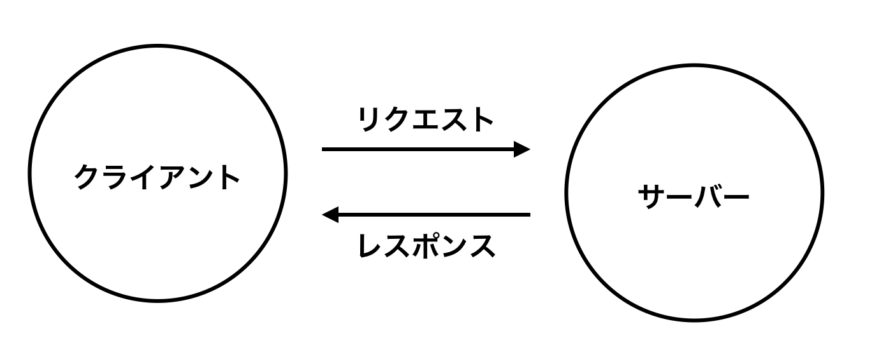

### クライアントとサーバー

- クライアントは、一般的なウェブユーザーが使うインターネットに接続された端末 (例えば Wi-Fi に接続されているコンピューターや、モバイルネットワークに接続されているスマートフォン) と、これらの端末で利用できるウェブにアクセスするソフトウェア (ふつうは Firefox や Chrome などのウェブブラウザー) のこと
-サーバーとは、ウェブページ、サイト、アプリを格納しているコンピューターのことです。クライアント端末がウェブページにアクセスしたいときは、ウェブページのコピーがサーバーからクライアントにダウンロードされ、ユーザーのウェブブラウザーに表示される

### 上記以外の関わり
- インターネット接続
- TCP/IP: Transmission Control Protocol と Internet Protocol は、どのようにウェブ上をデータが動くのか、を定義した通信プロトコル。身近な例では、車やバイク (またはその辺りにあるもの) 
- DNS: Domain Name System はウェブサイトの住所録のようなもの。ブラウザーにウェブアドレスを入力すると、ブラウザーはウェブサイトを取得する前に DNS を見て、ウェブサイトの IP アドレスを探す。ブラウザーはウェブサイトがどのサーバーにいるかを探し出す必要があり、それで HTTP のメッセージを正しい場所（下記参照）に送ることができる。
- HTTP: Hypertext Transfer Protocol は、クライアントとサーバーが対話をする方法を定義するアプリケーションプロトコル。これは商品を注文するための言語のようなもの。
- コンポーネントファイル: ウェブサイトは多くの異なるファイルで構成される。これらのファイルは主に 2 種類に当てはまる。
  - コードファイル: ウェブサイトは主に HTML、CSS、JavaScript から作られる
  - 資産 (Assets): これは画像、音楽、動画、Word 文書、PDF といったウェブサイトを構成するコード以外のすべての材料の集合的な名前

### 構成するファイルが解釈される順序
1. ブラウザーはまず HTML ファイルを解釈し、 <link> 要素による外部 CSS スタイルシートへの参照や、 <script> 要素によるスクリプトへの参照を認識するようになる
2. ブラウザーは HTML を解釈しながら、 <link> 要素から見つかった CSS ファイルと <script> 要素から見つかった JavaScript ファイルに対してサーバーにリクエストを送り返し、それらから CSS と JavaScript を解釈する
3. ブラウザーは解釈された HTML からメモリー内にある DOM（Document Object Model）ツリーを生成し、解釈された CSS からメモリー内に CSSOM 構造を生成し、解釈された JavaScript をコンパイルして実行する
4. ブラウザーが DOM ツリーを構築し、 CSSOM（CSS Object Model）ツリーからスタイルを適用して JavaScript を実行すると、ページの視覚表現が画面に描かれ、ユーザーはページの内容を見て、それとの対話を始めることができる

DNS（Domain Name Systems）の説明

- 実際のウェブアドレスは、 63.245.215.20 のような特殊な数字
  →これは、 IP アドレスと呼ばれ、ウェブ上の一意の場所を表すが、あまり覚えやすくはない。それが、ドメインネームシステムが発明された理由

